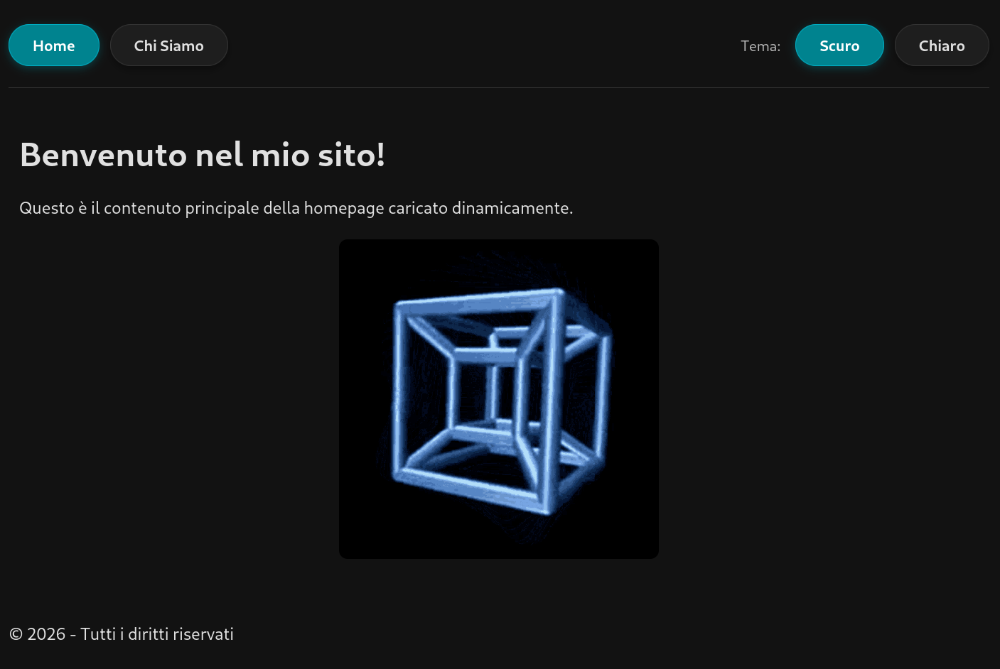

Studio per creazione siti web
## Prewiew

## Utilizzo Debug
- per attivare la debug mode andare su public/index.php e impostare il valore DEBUG_MODE su true
```text
├── config
│   └── db.php
├── includes
│   ├── footer.php
│   ├── header.php
│   └── navbar.php
├── localrun.sh
├── print.sh
├── public
│   ├── assets
│   │   ├── css
│   │   │   └── style.css
│   │   ├── img
│   │   │   ├── screen.png
│   │   │   └── spinning-cube.gif
│   │   └── js
│   │       └── main.js
│   ├── favicon.ico
│   └── index.php
├── README.md
└── views
    ├── about.php
    └── home.php
```
